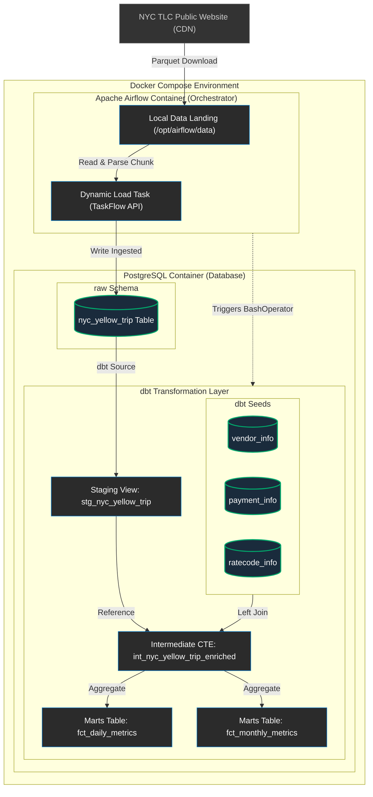
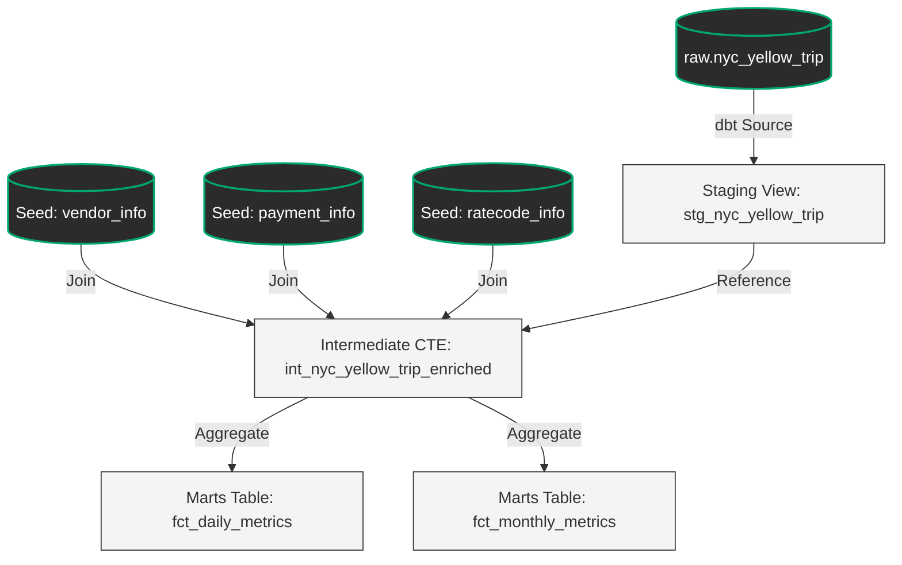

# NYC Taxi Data ELT Pipeline

An end-to-end, production-grade **ELT (Extract-Load-Transform)** data pipeline that orchestrates the parallel ingestion of NYC Yellow Taxi parquet files from public sources, loads them into a PostgreSQL database, and performs modular data transformations and testing using **dbt Core**.

The pipeline is fully containerized with **Docker** and orchestrated using **Apache Airflow**, demonstrating advanced concepts in data orchestration, dimensional modeling, and data quality testing.

---

## 🛠️ Technology Stack

* **Orchestrator:** Apache Airflow 3.x (utilizing TaskFlow API and Dynamic Task Mapping)
* **Transformation Engine:** dbt Core v1.10.x (with PostgreSQL adapter)
* **Database:** PostgreSQL 16
* **Infrastructure:** Docker & Docker Compose
* **Programming Languages:** Python 3.12, SQL (PostgreSQL dialect)

---

## 🏗️ System Architecture & Orchestration

This project runs inside a containerized network orchestrated by **Docker Compose**. **Apache Airflow** acts as the central orchestrator (maestro), managing the ingestion workflow. A **PostgreSQL** database acts as the storage engine. Once the raw ingestion is completed by Airflow, it triggers the **dbt** transformation layer via the CLI.



---

## 📐 Data Lineage & Modeling

Data transformations are modeled and compiled using **dbt**. Raw database records are cleaned and cast in the Staging layer, enriched with static dimensional codes (Seeds) in the Intermediate layer, and finally consolidated into analytical Marts (Fact tables) for easy BI querying.



---

## 💡 Key Architectural Design Choices

### 1. Decoupled Orchestration (Production-Ready Architecture)
* **Development Setup:** Airflow triggers dbt via the `BashOperator` running inside the scheduler container. This provides a simple, lightweight configuration for local prototyping.
* **Production Design:** In an enterprise environment, triggering dbt locally on the Airflow worker is an anti-pattern due to resource starvation (OOM crashes). The production blueprint decouples compute from orchestration using `KubernetesPodOperator` (K8s) or `EcsRunTaskOperator` (AWS ECS). This keeps the orchestrator extremely lightweight and isolates dbt container crashes.

### 2. Modular dbt Layers & DRY Principle
* **Staging Layer (`stg_`)**: Acts strictly as a 1-to-1 mapping with the raw tables. Responsibilities are limited to renaming columns, data type casts, and basic garbage filtering. Staging is materialized as a physical **`table`** in this project to cache casts, preventing PostgreSQL from executing expensive cast operations multiple times downstream.
* **Intermediate Layer (`int_`)**: Used to enrich the dataset by performing `LEFT JOIN`s on static dimensional **dbt Seeds** (CSV files loaded directly to the database). Materialized as **`ephemeral`** (compiling to CTEs inside the final queries) to keep the database schema clean and free of intermediate tables.
* **Marts Layer (`fct_`)**: Pre-aggregates daily and monthly metrics for BI consumption. Materialized as **`table`** objects to guarantee sub-second read performance for BI dashboards, paying the compilation cost only once during pipeline execution.

### 3. Advanced Data Quality Testing
* **Custom Generic Test Macro (`is_positive`)**: Written as a reusable Jinja macro in the `macros/` directory. Validates that numeric columns are non-negative (`>= 0`), avoiding the need to write repetitive singular SQL files for columns like `trip_distance`, `passenger_count`, and `total_amount`.
* **Accepted Values Validation**: Employs dbt's built-in `accepted_values` test on columns like `payment_type` to fail the pipeline immediately if the raw data introduces undocumented codes.
* **Sane Date Boundaries**: The staging layer extracts the `year` and `month` from `pickup_datetime` and compares them with the metadata columns `file_year` and `file_month`. This discards trips containing corrupted clock logs (e.g., trips reported in 2008 or 2035) without losing data.

---

## 🚀 How to Run Locally

### Prerequisites
* Docker Desktop installed and running.
* Git.

### 1. Setup Environment
Clone the repository to your local machine (replace `<your-github-username>` with your actual GitHub handle):
```bash
git clone <your-repo-url>
cd nyc-taxi-elt-pipeline
```

Ensure a `.env` file exists in the root directory (based on `.env.example`) containing database credentials and parameters.

### 2. Start the Pipeline
Launch the Docker services:
```bash
docker compose -f infra/docker-compose.yml --env-file .env up -d --build
```
This builds a custom Airflow image containing `dbt-postgres` and libraries (like `pyarrow` and `sqlalchemy`), boots the PostgreSQL database, and runs database migrations.

### 3. Trigger Ingestion & Transformation
1. Open the Airflow Web UI in your browser at `http://localhost:8082` (the port mapped in the `docker-compose.yml` config).
2. Log in using the default development credentials:
   * **Username:** `airflow`
   * **Password:** `airflow`
3. Locate the `nyc_taxi_elt_pipeline` DAG, toggle it to **Active**, and click **Trigger DAG**.
4. The pipeline will download the Parquet files in parallel, clean them, execute `dbt seed` (loading data dictionaries), `dbt run` (compiling layers), and `dbt test` (verifying quality constraints).

---

## 📊 Sample Queries (Marts Layer)

Once the pipeline has completed successfully, you can connect to the PostgreSQL instance using any database client (such as DBeaver, pgAdmin, or Datagrip) with the credentials specified in your `.env` file. 

Here are three advanced SQL queries to analyze the consolidated analytical layer:

### 1. Monthly Vendor Performance & Tip Percentages
This query aggregates monthly metrics, showing total passenger counts, total revenue, average fare per trip, and average tip percentage, sorted by period and vendor:

```sql
SELECT 
    year_month,
    vendor_name,
    total_trips,
    total_passengers,
    total_revenue,
    avg_fare_per_trip,
    tip_percentage AS avg_tip_percentage
FROM marts.fct_monthly_metrics
ORDER BY 
    year_month DESC, 
    total_revenue DESC;
```

### 2. High-Value Days Analysis (Top 5 Days by Revenue)
Finds the top 5 days in daily history that yielded the highest average trip distances and revenues. This helps identify peak travel dates and vendor market share:

```sql
SELECT 
    pickup_date,
    vendor_name,
    total_trips,
    total_revenue,
    avg_trip_distance,
    avg_duration_minutes
FROM marts.fct_daily_metrics
ORDER BY 
    total_revenue DESC
LIMIT 5;
```

### 3. Data Quality Audit: Cleaned vs Raw Records
Audit query to inspect the effectiveness of the staging date-clock and trip validity filters. It contrasts the total row count in raw storage against the validated records that made it to staging:

```sql
SELECT 
    'raw.nyc_yellow_trip' AS layer_table, 
    COUNT(*) AS record_count,
    'Dirty raw source data' AS description
FROM raw.nyc_yellow_trip

UNION ALL

SELECT 
    'staging.stg_nyc_yellow_trip' AS layer_table, 
    COUNT(*) AS record_count,
    'Cleaned (Non-negative & valid date clock)' AS description
FROM staging.stg_nyc_yellow_trip;
```
